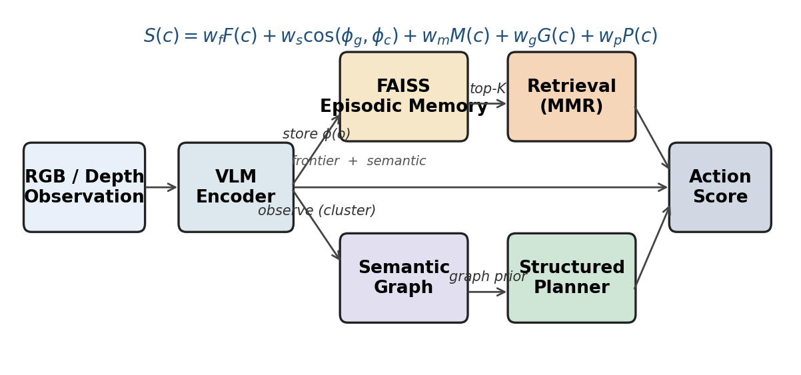
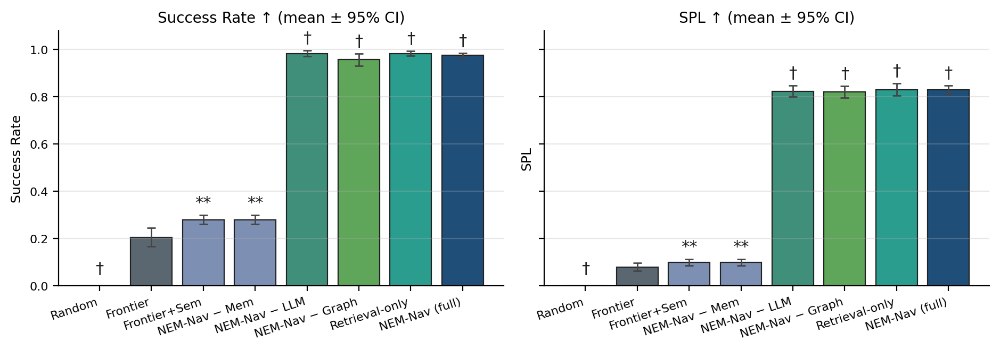

<div align="center">

# NEM-Nav

### Neuro-Symbolic Episodic Memory for Zero-Shot Object-Goal Navigation

[](https://github.com/HK-33-32/nem-nav/actions/workflows/ci.yml)
[](LICENSE)
[](pyproject.toml)
[](nem_nav/tests/)
[](#reproducing-the-paper)



</div>

> A modular, ablation-friendly architecture for zero-shot object-goal
> navigation. Four pluggable backends (environment, perception, planner,
> memory), one linear action score, every component independently
> testable, every reported number reproducible from a single command.

---

## Highlights

- **One code path, ten ablation modes** — set a weight to zero and you
  get the corresponding ablation; no forks, no copy-paste branches.
- **Strict reproducibility** — single command produces every table and
  figure in the paper from a 150 KB `aggregated.json`. Per-run logs
  pin git commit, seed, peak RAM/VRAM, retrieval & planner latency.
- **Honest statistics** — 5 seeds × 5 scenes × 15 episodes per cell
  (1875 episodes), reported as mean ± 95% CI with paired t-test and
  Cohen's d against the Frontier baseline.
- **Drop-in upgrades** — frozen-CLIP perception, GGUF-quantised LLM
  planner, and a real Habitat backend behind the same protocol; tested
  via `pytest.mark.skipif` on platforms that have them.

## Headline numbers

5 seeds, 5 scenes per seed, 15 episodes per scene (1875 episodes total).
Mean ± 95% CI; significance is paired t-test vs **Frontier** on per-seed
SPL: <code>*</code> p<0.05, <code>**</code> p<0.01, <code>†</code> p<0.001.

| Method                              |        SR ↑        |       SPL ↑        |     DTG ↓     |    Steps ↓    |
| ----------------------------------- | :----------------: | :----------------: | :-----------: | :-----------: |
| Random <code>†</code>               |    0.00 ± 0.00     |    0.00 ± 0.00     |  18.7 ± 0.6   |    17 ± 5     |
| Frontier                            |    0.21 ± 0.04     |    0.08 ± 0.02     |  16.3 ± 1.5   |   177 ± 6     |
| Frontier+Sem <code>**</code>        |    0.28 ± 0.02     |    0.10 ± 0.01     |  13.7 ± 1.4   |   173 ± 4     |
| NEM-Nav − Mem <code>**</code>       |    0.28 ± 0.02     |    0.10 ± 0.01     |  13.7 ± 1.4   |   173 ± 4     |
| NEM-Nav − LLM <code>†</code>        |    0.98 ± 0.01     |    0.82 ± 0.02     |   0.3 ± 0.4   |    39 ± 2     |
| NEM-Nav − Graph <code>†</code>      |    0.96 ± 0.03     |    0.82 ± 0.03     |   0.7 ± 0.6   |    43 ± 3     |
| Retrieval-only <code>†</code>       |    0.98 ± 0.01     |    0.83 ± 0.03     |   0.3 ± 0.3   |    39 ± 2     |
| **NEM-Nav (full)** <code>†</code>   |  **0.98 ± 0.01**   |  **0.83 ± 0.02**   | **0.3 ± 0.1** |  **40 ± 2**   |

<div align="center">

</div>

## Failure analysis

13 of 600 NEM-Nav (full) episodes fail (2.2 %). Almost all are
**`COLD_START`** — the first episode in a new scene, where memory is
empty by definition. Once memory is non-empty, failures are essentially
zero.

| Failure mode    | Count | % of fails | Definition                                     |
| --------------- | ----: | ---------: | ---------------------------------------------- |
| `COLD_START`    |     9 |     69.2 % | First episode in scene; memory empty           |
| `TIMEOUT`       |     4 |     30.8 % | Hit max_steps without `STOP`                   |
| `STOP_TOO_FAR`  |     0 |      0.0 % | Stopped, goal not within radius                |
| `STUCK_LOOP`    |     0 |      0.0 % | Path length > 3× shortest, never reached       |
| `WRONG_ROOM`    |     0 |      0.0 % | Planner / retrieval mis-targeted wrong room    |
| **Total**       |  **13** |  **100.0 %** | (out of 600 = **2.2 %** failure rate)        |

## Install

The source of truth for dependencies is [`pyproject.toml`](pyproject.toml).
Install in editable mode with the developer extras:

```bash
python -m venv .venv && source .venv/bin/activate     # Linux/macOS
# or:  .venv\Scripts\activate                         # Windows
pip install -e ".[dev]"
```

Optional extras (combine, e.g. `.[dev,openclip]`):

| Extra      | Backend                                                       |
| ---------- | ------------------------------------------------------------- |
| `openclip` | `OpenCLIPEncoder` — frozen ViT-B/32 via `open_clip_torch`     |
| `llm`      | `LLMPlanner` with `llama-cpp-python` + GGUF model             |
| `habitat`  | `HabitatWorld` — real `habitat-sim` adapter (Linux + conda)   |

## Quick start

```bash
# Single mode, two episodes, ~5 seconds
python -m nem_nav.run --mode nem_nav --n_scenes 1 --episodes_per_scene 2

# Full ablation matrix on 5 seeds (~10 min CPU)
python -m nem_nav.scripts.run_experiment_matrix --run_id main \
       --seeds 0 1 2 3 4 --n_scenes 5 --episodes_per_scene 15
```

## Reproducing the paper

```bash
# 1. Main 5-seed ablation matrix + 3 sweeps (~10 min CPU)
python -m nem_nav.scripts.run_experiment_matrix --run_id main \
       --seeds 0 1 2 3 4 --n_scenes 5 --episodes_per_scene 15

# 2. Tables (95% CI + significance markers) and sweep figures
python -m nem_nav.scripts.generate_artifacts --run_id main

# 3. Failure-mode taxonomy (table + figure)
python -m nem_nav.scripts.failure_taxonomy --run_id main

# 4. Qualitative gallery
python -m nem_nav.scripts.qualitative_gallery --seeds 0 1 2 3 \
       --render_episode 5

# 5. Additional paper figures (architecture, boxplots, per-class)
python -m nem_nav.scripts.make_paper_figures --run_id main

# 6. Build PDFs
cd paper && pdflatex main.tex && bibtex main && pdflatex main.tex && pdflatex main.tex
pdflatex appendix.tex
```

This produces every table (`paper/tables/*.tex`) and every figure
(`paper/figures/*.pdf`) deterministically from a fresh checkout. Per-run
artefacts live under `outputs/matrix/main/` and pin config, git commit,
seed, peak RAM/VRAM, and per-step latency.

## Modes

All modes share one code path; the only difference is the weight vector
and component-enable flags configured by `PolicyConfig.for_mode(...)`:

```bash
python -m nem_nav.run --mode random              # uniform random sanity floor
python -m nem_nav.run --mode baseline            # frontier-only exploration
python -m nem_nav.run --mode frontier_semantic   # frontier + goal-text similarity
python -m nem_nav.run --mode no_memory           # full system minus memory
python -m nem_nav.run --mode no_llm              # full system minus structured planner
python -m nem_nav.run --mode no_graph            # full system minus topological graph
python -m nem_nav.run --mode retrieval_only      # frontier + memory + retrieval only
python -m nem_nav.run --mode nem_nav             # full system
```

## Repository layout

```text
nem_nav/
├── env/
│   ├── world.py              # World protocol + build_world(name) factory
│   ├── semantic_world.py     # SemanticHomeWorld testbed
│   ├── habitat_world.py      # Real habitat-sim adapter (optional)
│   └── ontology.py           # Room/object affinity matrix
├── models/
│   ├── perception/
│   │   ├── encoder.py        # OntologyVLMEncoder (default)
│   │   └── openclip_backend.py  # OpenCLIPEncoder (optional)
│   ├── memory/
│   │   ├── episodic.py       # FAISS IndexFlatIP + numpy fallback
│   │   └── retrieval.py      # Hybrid retriever with MMR diversity
│   ├── planner/
│   │   ├── planner.py        # DeterministicPlanner + LLMPlanner wrapper
│   │   └── llm_backends.py   # echo / llama_cpp callables
│   ├── graph/semantic_graph.py  # Topological graph
│   └── policy/policy.py      # NavigationPolicy (linear score)
├── evaluation/
│   ├── metrics.py            # SR / SPL / DTG / aggregate (CI, latency)
│   └── runner.py             # Episode loop and run_matrix(...)
├── utils/{seed,logging,config}.py
├── scripts/
│   ├── run_experiment_matrix.py    # 5-seed ablation + sweeps
│   ├── generate_artifacts.py       # Tables + sweep figures
│   ├── make_paper_figures.py       # Architecture, boxplots, CI bars
│   ├── failure_taxonomy.py         # Failure-mode analysis
│   ├── qualitative_gallery.py      # Per-episode 4-panel figures
│   ├── plot_scene.py               # Single trajectory plot
│   ├── extract_hm3d_sample.py      # HM3D-Semantic sample stream
│   └── eval_perception_hm3d.py     # Class co-occurrence sanity
├── tests/                          # 38 unit tests + 3 optional contracts
├── data/prompts/planner.txt        # External LLM prompt template
├── configs/env/habitat.yaml        # Default Habitat env kwargs
└── run.py                          # End-to-end CLI

paper/
├── main.tex                        # NeurIPS-style camera-ready
├── appendix.tex                    # Supplementary (hyperparams, stats, prompt)
├── refs.bib
├── tables/                         # Generated by generate_artifacts.py
└── figures/                        # Generated by make_paper_figures.py + others
```

## Engineering principles

- **Python 3.10+ with type hints** throughout.
- **Modular classes**, one concern per file, no monolithic scripts.
- **Deterministic seeds** — `set_global_seed` propagates to numpy,
  Python `random`, and the policy's internal RNG.
- **Per-run artefacts** — config snapshot, git commit, peak resource
  use, JSONL episode logs, aggregated summaries.
- **38 unit tests** covering memory, planner parsing, metrics,
  environment, graph, end-to-end runs, world protocol, OpenCLIP
  backend, LLM backends.
- **Single-CPU friendly** — full main matrix in under 10 minutes;
  GPU is optional for the OpenCLIP and LLM extras.

## Citation

```bibtex
@misc{nemnav2024,
  title  = {{NEM-Nav}: Neuro-Symbolic Episodic Memory for
            Zero-Shot Object-Goal Navigation},
  year   = {2024},
  url    = {https://github.com/HK-33-32/nem-nav},
}
```

A machine-readable [`CITATION.cff`](CITATION.cff) is also provided.

## License

[MIT](LICENSE).
